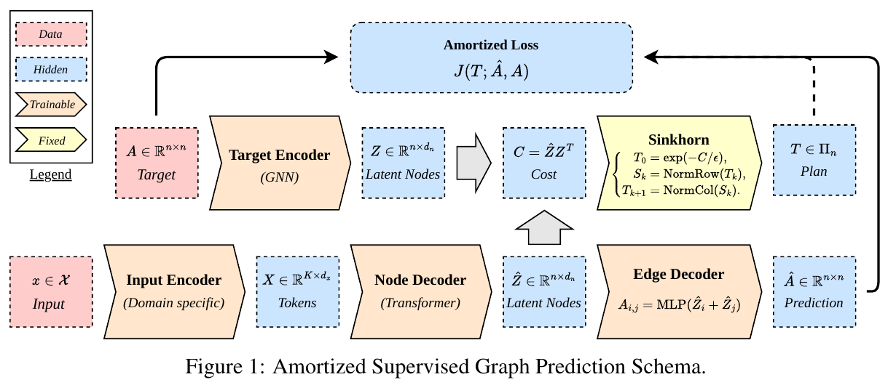
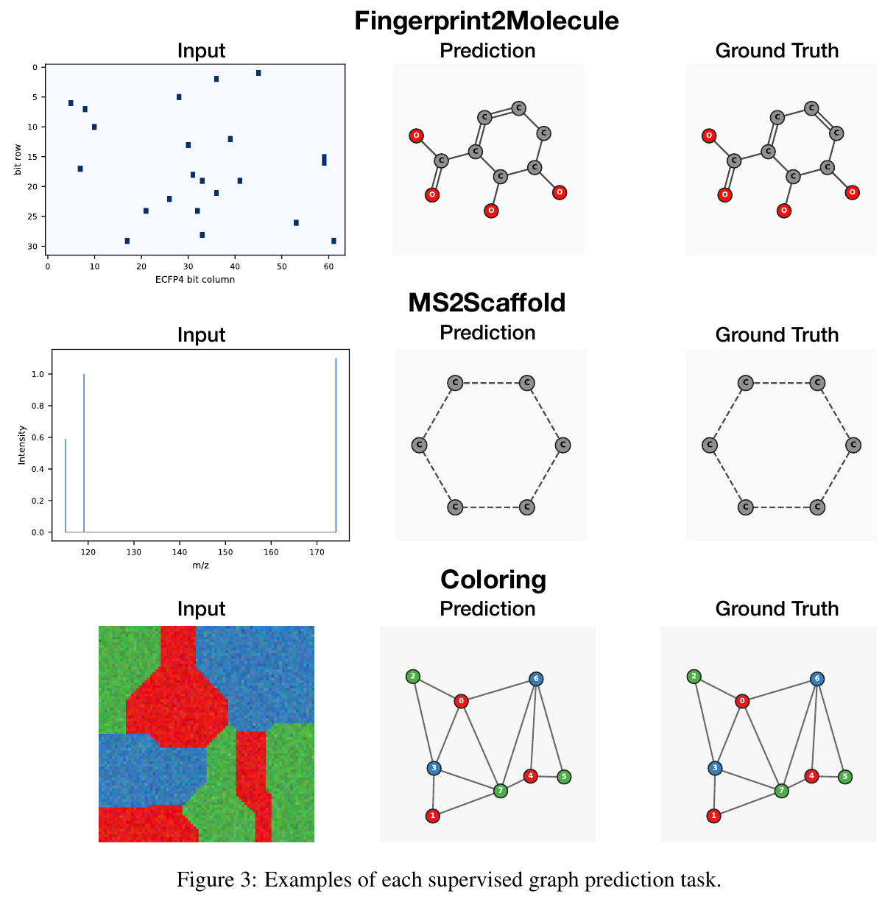

# Graph Matching Relaxations and Amortization for Supervised Graph Prediction

Research code for predicting graphs from images, molecular fingerprints, and mass
spectra. The implementation, **Any2GraphV2**, combines a modality-specific encoder,
a Transformer graph decoder, and a learned Sinkhorn matcher. A detached mirror
solver provides an alternative alignment method.

**Paper:** *Graph Matching Relaxations and Amortization for Supervised Graph
Prediction* — Federico Méndez, Paul Krzakala, Gabriel Melo, Charlotte Laclau,
Rémi Flamary, and Florence d'Alché-Buc.



*Figure 1 from the paper: input and target encoders, graph prediction, and learned matching.*

## Start here

Python 3.10–3.12 is supported; the fresh-environment check used Python 3.12.
Install [uv](https://docs.astral.sh/uv/getting-started/installation/), then run
from the repository root:

```bash
uv sync --frozen
uv run --frozen python scripts/reproduce_smoke.py --output-dir artifacts/smoke
```

This generates 16 Coloring examples, trains a compact model for **two optimizer
steps**, reloads a checkpoint, and evaluates a validation batch. It requires no
Slurm or W&B account. Use a new output directory on each run. Inspect
`artifacts/smoke/summary.json` for metrics, versions, hashes, and provenance.
This workflow checks execution; it does not reproduce paper accuracy.

## Tasks

| Task | Input | Target |
| --- | --- | --- |
| Coloring | Noisy RGB Voronoi image | Region adjacency graph with four node colors |
| Fingerprint2Molecule | Active bits of a radius-2, 2048-bit Morgan fingerprint | Molecular graph |
| MS2Scaffold | Annotated MS/MS peaks and collision energy | Molecular scaffold graph |

CLI task names are `coloring2graph`, `fingerprint2graph`, and `ms2graph`.
MS2Scaffold uses scaffold targets; it is not full-molecule identification.



*Figure 3 from the paper: Fingerprint2Molecule, MS2Scaffold, and Coloring examples.*

## Experiments

[Experiment configurations](experiments/paper/README.md) provide runnable YAMLs
for the main comparisons, loss ablations, and matching-efficiency sweeps.
The [CSV files](experiments/paper/csv/) contain the reported results and the
settings used to generate those configs.

```bash
uv run --frozen python -m any2graph_v2.train_cli \
  --config experiments/paper/configs/main-coloring20-matcher.yaml
```

| Paper item | CSV | Contents |
| --- | --- | --- |
| Table 1 | [Main comparison](experiments/paper/csv/table1_main_results.csv) | Edit distance and GI accuracy for four methods/tasks |
| Table 2 | [Loss ablation](experiments/paper/csv/table2_loss_ablation.csv) | Original, alternative, and reversed-argument objectives |
| Table 3 | [Dataset statistics](experiments/paper/csv/table3_dataset_statistics.csv) | Graph sizes and sample counts |
| Tables 4–5 | [Core settings](experiments/paper/csv/table4_hyperparameters.csv), [Coloring budgets](experiments/paper/csv/table5_coloring_budgets.csv) | Architecture and training settings |
| Table 6 / Figure 2 left | [Efficiency grid](experiments/paper/csv/table6_frontier_grid.csv) | Expanded solver/matcher configurations; raw scores pending |
| Table 7 | [Epsilon candidates](experiments/paper/csv/table7_epsilon_candidates.csv) | Rounded values in units of 1e-6 |
| Figure 2 right | [Scaling template](experiments/paper/csv/figure2_scaling_results_template.csv) | Capacity/method grid; measurements not yet included |

GI accuracy is reported as a percentage; blank cells indicate unavailable values.
The [CSV guide](experiments/paper/CSV_GUIDE.md) explains the columns, units,
and configuration details.

## Train and evaluate

Start with [data preparation](docs/DATA.md), [Coloring generation](docs/COLORING.md),
and the [installation and training guide](docs/USAGE.md). Experiment launchers are indexed in the [scripts guide](scripts/README.md).
Use the Python CLIs on a workstation or inside your own scheduler:

```bash
uv run --frozen python -m any2graph_v2.train_cli --help
uv run --frozen python -m any2graph_v2.evaluate_cli --help
uv run --frozen python -m any2graph_v2.eval_matcher_cli --help
```

The learned matcher and CPU Frank–Wolfe path can run locally. Mirror matching
requires CUDA. The optional GPU Frank–Wolfe assignment extension has separate
build requirements described in [the setup guide](docs/USAGE.md).
Training defaults to W&B online; pass `--wandb-mode disabled` to avoid an account.
Checkpoints retain configuration and optimizer state; evaluation reloads scientific
settings from the checkpoint. See [training and evaluation](docs/TRAINING.md).

## Reproducibility

The [reproduction guide](docs/REPRODUCIBILITY.md) covers the CPU demo and
validation steps. The [experiment inventory](experiments/paper/README.md)
tracks the configurations and run records needed for paper-scale reproduction.

## Method and repository map

The transport plan uses `T[p,t]`: predicted slots by target slots. The original
objective weights pairwise node discrepancies and quadratic edge discrepancies
by this plan. Alternative losses align graph fields before scoring them.
Probability-space alignment, padding, and imperfect-marginal handling are
specified in [LOSS.md](docs/LOSS.md). See the [architecture guide](docs/ARCHITECTURE.md)
for component interfaces.

- `src/`: models, matching, losses, data, and CLIs (installed as `any2graph_v2`).
- `configs/`: configurable presets; command-line arguments override them.
- [scripts/README.md](scripts/README.md): demo, data preparation, and experiment commands.
- `experiments/paper/`: reported tables and reproduction inventory.
- `docs/`: scientific details, usage, and [reproduction status](docs/REPRODUCIBILITY.md).

## Citation and reuse

Use the paper title and authors above when referring to this work; an archival
citation will be added when available. Any2Graph and GRALE inform this
implementation. A project license and complete third-party attribution are still
pending; this repository does not yet claim an open-source license.

## Acknowledgments

This work builds on [Any2Graph](https://github.com/KrzakalaPaul/Any2Graph)
([paper](https://arxiv.org/abs/2402.12269)) and
[GRALE](https://github.com/KrzakalaPaul/GRALE)
([paper](https://arxiv.org/abs/2505.22109)) for supervised graph prediction,
graph matching, and reconstruction objectives. The mass-spectrometry task uses
[MassSpecGym](https://github.com/pluskal-lab/MassSpecGym)
([paper](https://arxiv.org/abs/2410.23326)).

```bibtex
@article{krzakala2024any2graph,
  title={Any2graph: Deep end-to-end supervised graph prediction with an optimal transport loss},
  author={Krzakala, Paul and Yang, Junjie and Flamary, R{\'e}mi and d'Alch{\'e}-Buc, Florence and Laclau, Charlotte and Labeau, Matthieu},
  journal={Advances in Neural Information Processing Systems},
  volume={37},
  pages={101552--101588},
  year={2024}
}
@article{krzakala2025quest,
  title={The quest for the GRAph Level autoEncoder (GRALE)},
  author={Krzakala, Paul and Melo, Gabriel and Laclau, Charlotte and d'Alch{\'e}-Buc, Florence and Flamary, R{\'e}mi},
  journal={arXiv preprint arXiv:2505.22109},
  year={2025}
}

```
